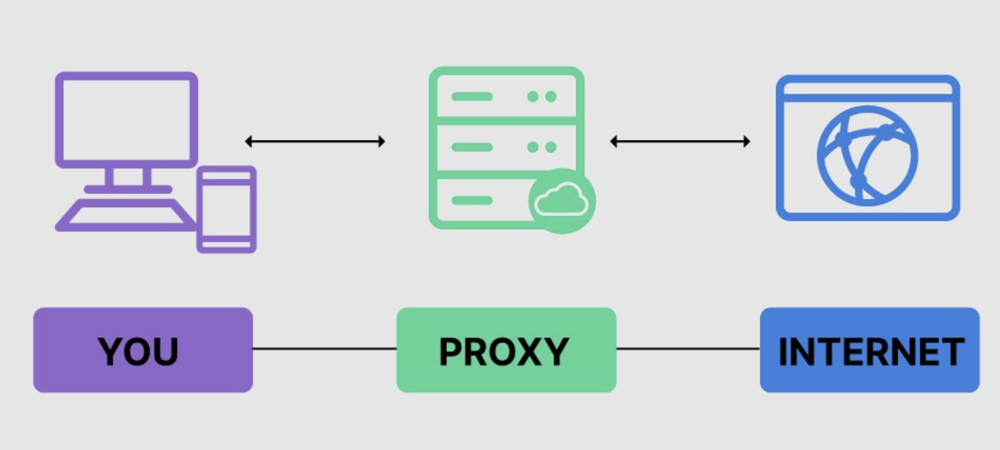

## What is a Web Proxy?
Web proxies are specialised tools that can be set up between a browser/mobile application and a back-end sever to capture and view all the web requests being sent between both ends, essentially acting as a man in the middle. 

- Web proxies mainly work at web ports such as but not limited to HTTP/80 and HTTPS/443
- Web proxies function to capture and replay web requests.

## Main 

